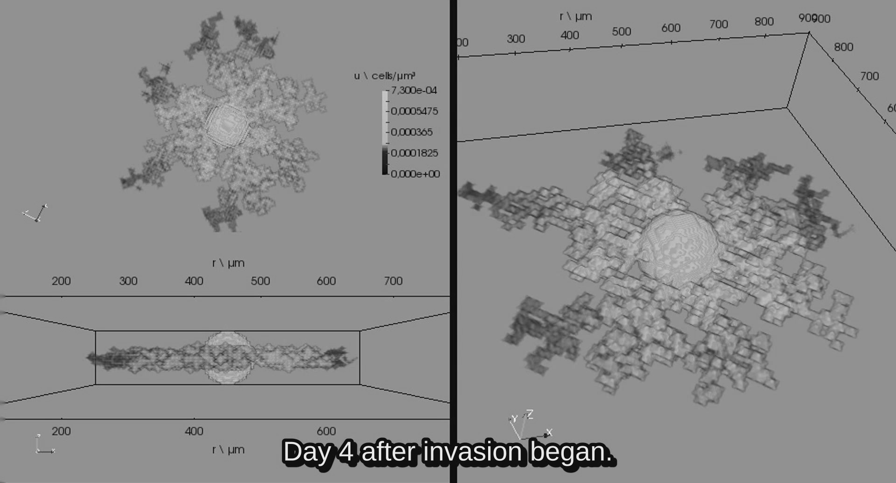

#

# LibreGrowth

Here we introduce LibreGrowth: a libre tumor growth code for simulating spheroid and rim development at benign and malignant stages over a conditioned media. It models each medium as a three-dimensional domain with an spatially variable diffusion coefficient, through the resolution of reaction-diffusion equations. The code is implemented in C++ for GNU/Linux systems, and optimized through the shared memory technology OpenMP. LibreGrowth provides a flexible implementation in order to facilitate upcoming studies concerning to the impact of the environment over the infiltration patterns. We expect that this kind of novel research tools help in the promotion of standard cancer therapies optimization, particularly in the context of personalized medicine.

# Scientific references

LibreGrowth is the latest version of the codes used in our previous studies to model the growth and infiltration of a tumor.

- E. Luján, M. S. Rosito, A. Soba, C. Suárez. LibreGrowth: a tumor growth code based on reaction-diffusion equations using shared memory. Computer Physics Communications Journal.
- E. Luján, D. Soto, M. S. Rosito, A. Soba, L. Guerra, J. C. Calvo, G. Marshall, C. Suárez. Microenvironmental influence on microtumour infiltration patterns: 3d mathematical modelling supported by in vitro studies, Integrative Biology 10 (2018) 325–334. doi:10.1039/C8IB00049B.
- E. Luján, D. Soto, M. S. Rosito, A. Soba, L. Guerra, G. Marshall, C. Suárez. Modelado matemático de un patrón de invasión tumoral a través de ecuaciones de reacción-difusión y fractales DLA (Diffusion Limited Aggregation), in: Mecánica Computacional, Vol. XXXV, 2017, pp. 387–400.
- E. Luján, L. Guerra, A. Soba, N. Visacovsky, D. Ganda, J. C. Calvo, C. Suárez. Mathematical modelling of microtumour infiltration based on in vitro experiments, Integrative Biology 8 (2016) 879–885. doi:10.1039/C6IB00110F.

# Code file descriptions

LibreGrowth code is organized in the following source files:

- src/main.cpp: Main simulation process (finite difference iterative scheme) is implemented in this file.
- src/par.h: Model parameters (i.e. proliferation coefficient) are defined in this file.
- src/scalar_field.h and src/scalar_field.cpp: ScalarField class is defined in this file.An instance of this class is used in main.cpp for depicting the tumor concentration.
- src/mesh.h and src/mesh.cpp: Mesh class keeps information about geometry and domain discretization. An instance of this class is used in the ScalarField class.
- src/makefile: Compilation process is implemented in this file.
- makefile: File cleaning, compilation, execution and loggin are implemented in this file.

#  How to modify the code

You can modify src/Params.h, where you will find a list of parameters to be adapted to your particular problem.

- Initial core radius. Units: um. (r_min_core_dim)
- Domain dim. Units: um. (x_min_dim, x_max_dim, etc.)
- Max. concentration of tumoral cells. Units: cells/um^3. (u_max_dim)
- Max. concentration of core cells. Units: cells/um^3. (u_core_max_dim)
- Invasion diffusion coefficient. Units: um^2/h. (D_inv_dim)
- Core velocity. Units: um/h. (vc_dim)
- Proliferation coefficient. Units: 1/h. (p_coef_dim)
- Source coefficient. Units: cell/(um^3 h). (s_dim)
- Max. time after invasion begins: 5 days. Units: h. (t_max_inv_dim)
- Max. time of benign stage. 10 days. Units: h. (t_max_benign_dim)
- How often you save an output file. (save_step)

# Compilation and execution instructions

- make: File cleaning and standard compilation
- make clean: Last compilation and execution file cleaning
- make run: File cleaning, standard compilation and execution
- make run-omp: File cleaning, OpenMP compilation and multi-thread execution
- make run-dbg: File cleaning, debug compilation and execution

#  Output

In the "data" folder you will find vtk and/or csv output files.

Each file represents the tumor concentration of a particular time.

Output formats were selected to be compatible with the powerful visualization tool: Paraview.

